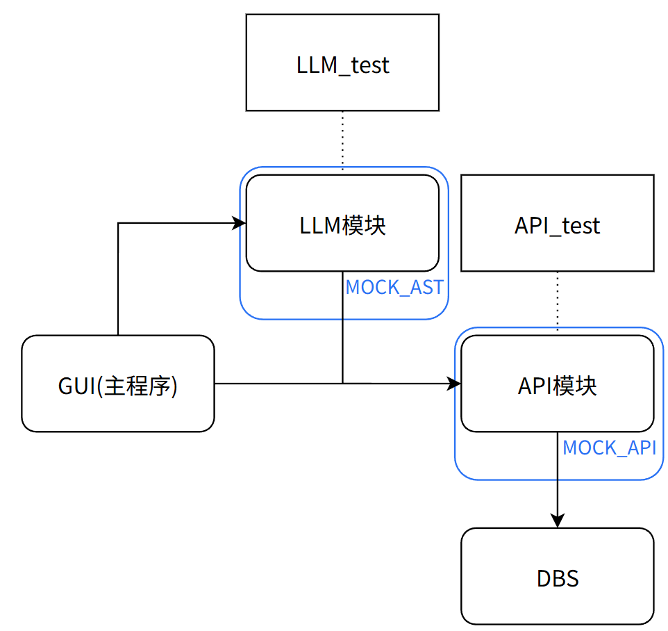
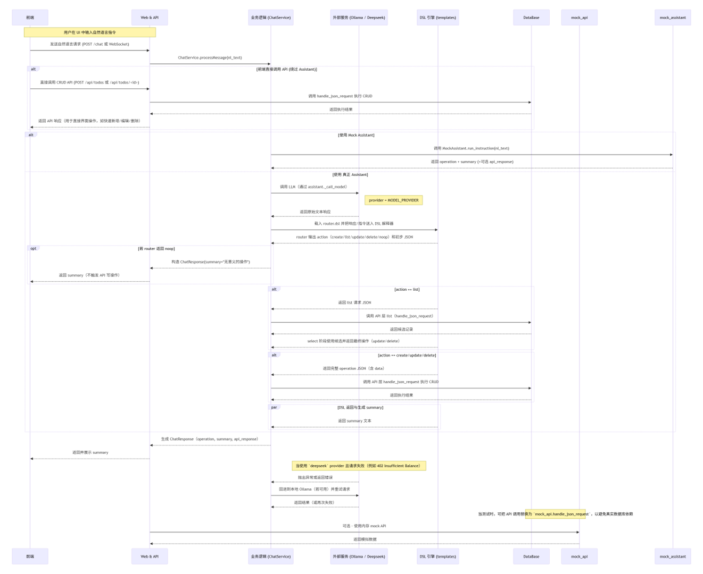
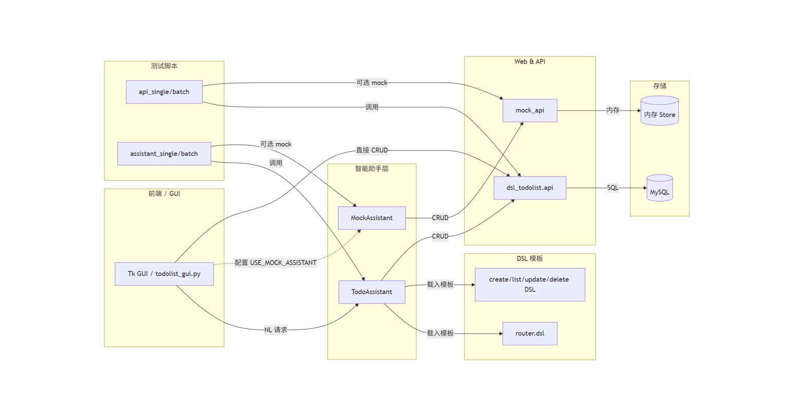
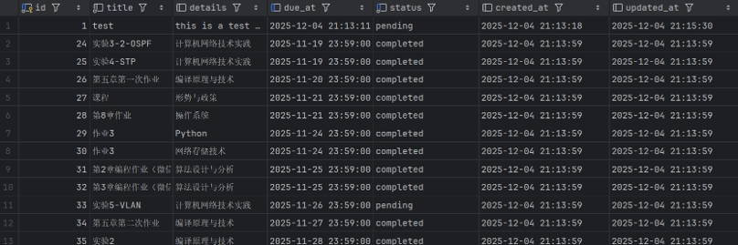
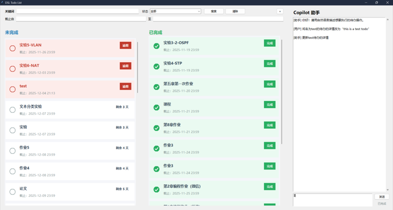
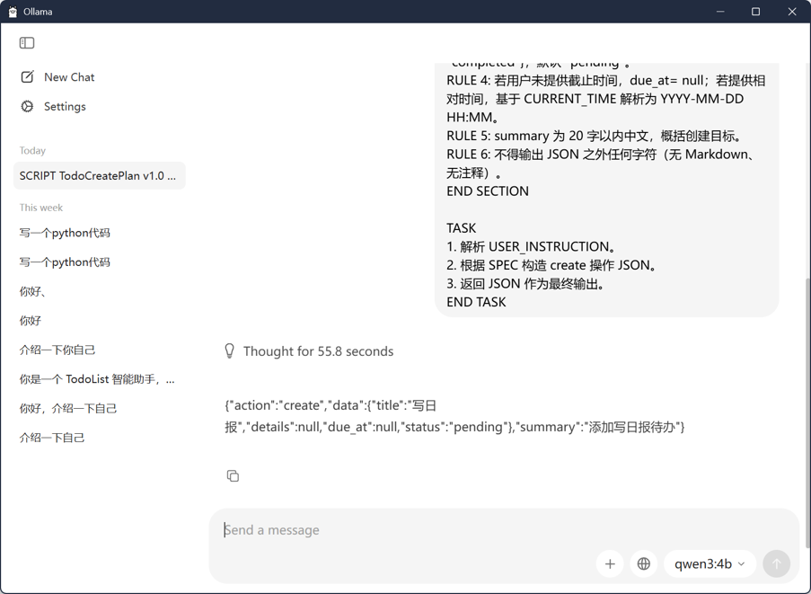
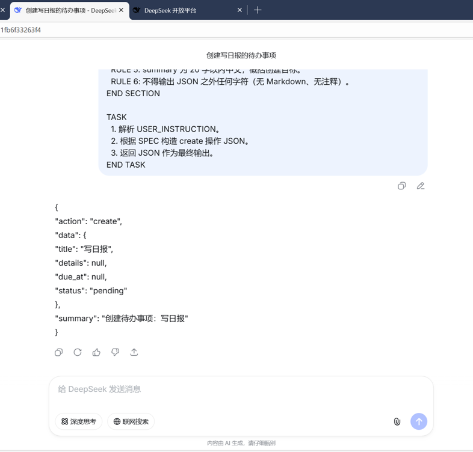
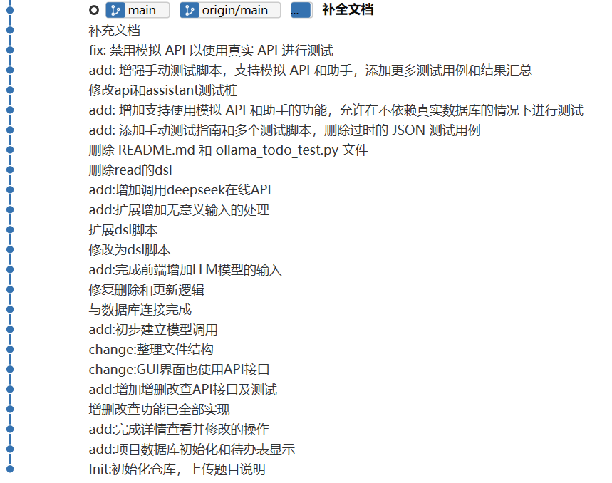

# 2025程序设计实践-大作业项目报告
- 姓名：杜昊阳
- 班级：2023211198
- 学号：2023211311
## 1 前言
基于 DSL 的 TodoList 智能助手，结合本地/在线 LLM 完成待办事项的意图解析、JSON 规范化以及数据库 CRUD 操作。目标：用脚本化 DSL 管控 LLM 输出、保证可测可控，并提供 GUI + API + 测试工具链的完整实现。

## 2 需求分析
### 2.1 功能需求
- 待办 CRUD：通过 JSON API 与 MySQL 存储交互，支持关键词/状态/时间范围筛选。
- 智能助手：将自然语言路由到 DSL（create/list/update/delete/noop）并生成合规 JSON，必要时调用 API 落库。
- DSL 约束：所有 LLM 输出必须是 action/data/summary 三元 JSON，时间统一 `YYYY-MM-DD HH:MM`。
- GUI：Tkinter 版双栏列表 + 右侧聊天面板；可切换真实/模拟 API、真实/模拟助手。
- 测试：API 与 Assistant 提供单次、批量驱动；支持 mock/stub、真实 LLM 与真实数据库两种路径。

### 2.2 非功能需求
- 易用性：命令行与 GUI 入口；提示信息清晰；summary 控制在 20 字内。
- 可测性：接口纯 JSON，mock_api/mock_assistant 提供无网络、无 DB 场景；批量驱动可重放。
- 安全性/配置：Deepseek API Key 硬编码仅为课程示例，生产需改为环境变量；DB 账号最小权限。
- 未实现/不在范围：用户多租户与鉴权、并发冲突处理、复杂权限模型、全文检索。

## 3 总体设计
子系统：
- DSL + LLM Assistant：加载 `prompts/*.dsl`，两阶段 delete/update 流程，封装 `_call_model` / `_call_api`。
- JSON API 层：`handle_json_request` 统一入口，分派 CRUD，返回规范 JSON。
- 数据库层：`db.ensure_schema` 保障表结构，`mysql.connector` 直连。
- GUI：`TodoApp` 管理过滤、列表、详情对话框与聊天面板；可注入 mock。
- Mock 层：`mock_api` 内存存储；`mock_assistant` 规则化 action 生成，便于 UI/离线测试。
- 测试工具：`tests/manual/*` 的单次/批量驱动，配合 `tests/TESTING.md` 指南。





## 4 详细设计
### 4.1 Assistant 与 DSL 流程
- 入口：`TodoAssistant.run_instruction(nl_text, apply_changes=True)` → `AssistantResult(operation, summary, api_response)`。
- 路由：`_route_action` 用 `router.dsl` 判定 {create|list|update|delete|noop}。
- create/list：`_run_operation_prompt` 直接用对应 DSL 生成 JSON。
- delete/update：Stage1 `delete_request/update_request` → 若需候选则调用 API list → Stage2 `delete_select/update_select` 只允许候选 id。
- 执行：`_call_api` 以 JSON 调用 `handle_json_request`，若 `apply_changes=False` 则仅返回 JSON 不落库。
- JSON 解析：`_extract_json` 从 LLM 响应中截取首个 `{...}`；`_ensure_action_data` 校验 id / data 类型。
- 模型接口：
	- 本地：Ollama `POST {model,prompt,stream=False}`。
	- 在线：Deepseek（OpenAI 兼容 SDK），messages: system + user(prompt)。

### 4.2 API 层与接口定义
- 入口：`handle_json_request(payload:str) -> str`，payload 形如 `{action, data}`；返回 `{"status":"ok|error", ...}`。
- 支持 action：create/read/update/delete/list；不合法返回 `status=error`。
- 主要内部函数（均抛出 ValueError 供统一捕获）：
	- `_create(data)`：校验 title 非空，status∈{pending,completed}；插入并回读。
	- `_read(data)`：必须有 id，回读单条。
	- `_update(data)`：需要 id 与至少一个字段；逐字段校验后更新。
	- `_delete(data)`：需要 id，返回 `{deleted: n}`。
	- `_list_items(filters)`：支持 keyword/状态(pending|completed|overdue)/due_from/due_to；按状态、截止时间排序。
- 时间格式：`%Y-%m-%d %H:%M`；`_parse_datetime` 支持 timestamp/datetime/字符串。

### 4.3 数据库设计
- 连接配置：`dsl_todolist/db.py` 中 `DB_CONFIG`（host/user/password/database/auth_plugin）。
- 表结构（见 `report/DB_SETUP.md`）：
	- `todos(id PK, title varchar(200) not null, details text, due_at datetime, status enum('pending','completed') default 'pending', created_at, updated_at, 索引 idx_due_at, idx_status)`。
- 初始化：`ensure_schema()` 在 API / GUI 启动时自动建表。
- 重置：`reset_tables()` 用于测试清表。
- 数据库示意：


### 4.4 GUI 设计
- 入口：`todolist_gui.py` 或 `python -m dsl_todolist.gui`；可选 `--mock-api / --mock-assistant`。
- 布局：左右分栏，左侧筛选 + 未完成/已完成列表，右侧聊天面板；详情/新建弹窗支持 Markdown 预览与截止时间校验。
- 主要类：
	- `TodoApp`：管理状态、过滤、API 调用、对话框、刷新列表。
	- `TodoListPanel` / `TodoTile`：列表与条目组件，支持完成/逾期徽章。
	- `AssistantChatPanel`：发送 NL 文本，显示 summary，失败提示。
	- `TodoDetailDialog`：详情/编辑/删除；`TodoCreateDialog`：新建。
- 前端截图：


### 4.5 配置文件说明
- 数据库初始化脚本：`report/DB_SETUP.md`（SQL 建库建表、账号授权、示例数据）。
- 模型配置：`assistant.py` 中 `MODEL_PROVIDER`、`DEFAULT_MODEL`、`DEEPSEEK_*` 常量；生产应改为环境变量读取。

### 4.6 日志说明
- API/Assistant/GUI 均在终端打印调用与结果（含 LLM Prompt、API 请求/响应）。
- 无额外日志文件；若需持久化可将 stdout 重定向或接入 logging。

### 4.7 接口协议说明
- 请求统一 JSON：`{"action": <create|read|update|delete|list|noop>, "data": {...}}`。
- 响应统一 JSON：成功 `{"status":"ok", "data": ...}`；失败 `{"status":"error", "message": "..."}`。
- 关键字段：
	- create data: `{title, details|null, due_at|null, status}`
	- read/delete: `{id}`
	- update: `{id, [title|details|due_at|status]+}`
	- list filters: `{keyword?, status?(pending|completed|overdue), due_from?, due_to?}`

## 5 测试报告
### 5.1 测试驱动设计
- API 驱动：`tests/manual/api_single_test.py` 交互输入 JSON；`api_batch_test.py` 读 cases 批量断言子串。
- Assistant 驱动：`tests/manual/assistant_single_test.py` 交互或 `--text`；`assistant_batch_test.py` 批量跑 LLM，校验 action/summary。
- GUI 可切换 `--mock-api/--mock-assistant` 实现集成/隔离两种模式。

### 5.2 测试桩设计
- `mock_api`：内存列表实现 CRUD，支持 keyword/status/overdue 简单过滤。
- `mock_assistant`：关键词规则选 action（create/list/update/delete/noop），必要时触发 mock_api，summary 固定格式，保证可重复。

### 5.3 自动测试脚本设计
- 用例文件：`tests/manual/api_cases.txt`（JSON|||期望子串）、`assistant_cases.txt`（NL|||action|||summary）。
- 命令示例（PowerShell）：
```powershell
python tests/manual/api_single_test.py
python tests/manual/api_batch_test.py --cases tests/manual/api_cases.txt
python tests/manual/assistant_single_test.py --text "帮我添加一个叫写日报的待办"
python tests/manual/assistant_batch_test.py --cases tests/manual/assistant_cases.txt
```

### 5.4 测试过程
- 真实 DB/LLM 路径：脚本默认使用真实 API 与 Deepseek（或配置的 Ollama）。
- 无网/无库路径：启用 `USE_MOCK_API/USE_MOCK_ASSISTANT` 或命令行切换，保持驱动逻辑不变。
- 运行记录见 `tests/自动测试终端输出.txt`（节选）：
	- API 单次 list 成功返回一条待办。
	- API 批量 5/5 通过。
	- Assistant 单次 create → 成功落库 id=71。
	- Assistant 批量多条用例均标记 “正确”。

### 5.5 测试结果
- 手动批量：API 5/5 通过；Assistant 用例按期望 action/summary 通过。
- 典型缺陷场景：无 id 的 update/delete 会被 DSL 流程转 list；非法日期将被 `_parse_datetime` 拒绝。

## 6 DSL 脚本编写指南
### 6.1 文法与约束（核心）
- 统一输出：仅 JSON，键为 action/data/summary，summary ≤ 20 字中文。
- 时间：`YYYY-MM-DD HH:MM`；未提供则 null；相对时间由 CURRENT_TIME 解析。
- delete/update 若未给 id，必须先返回 action=list 以便筛选。
- 当上下文提供 candidates，仅能从列表选择 id。

### 6.2 DSL 一览（标准输出示例）
| 文件 | 作用 | 标准输出格式示例 |
|---|---|---|
| create.dsl | 生成创建请求 | `{"action":"create","data":{"title":"...","details":null,"due_at":null,"status":"pending"},"summary":"..."}` |
| list.dsl | 生成筛选请求 | `{"action":"list","data":{"keyword":"...","status":"pending"},"summary":"..."}` |
| delete_request.dsl | delete 若无 id 转 list | delete: `{"action":"delete","data":{"id":123},"summary":"..."}` / list 同上 |
| delete_select.dsl | 从 candidates 选 id 删除 | `{"action":"delete","data":{"id":123},"summary":"..."}` |
| update_request.dsl | update 若无 id 转 list | update: `{"action":"update","data":{"id":123,"title":"..."},"summary":"..."}` / list 同上 |
| update_select.dsl | 从 candidates 选 id 更新 | `{"action":"update","data":{"id":123,"due_at":"2025-12-05 09:00"},"summary":"..."}` |
| router.dsl | 仅路由 action 或 noop | `{"action":"create"}` / `{"action":"noop"}` |
| todo_prompt.dsl | 通用助手规范 | `{"action":create|read|update|delete|list,"data":...,"summary":"..."}` |

### 6.3 范例（自然语言 → DSL → API）
- “帮我添加一个叫写日报的待办” → router:create → create.dsl → `{action:create, data:{title:"写日报",due_at:null,status:pending}, summary:"创建待办事项：写日报"}` → API create。
- “列出所有未完成的任务” → router:list → list.dsl → `{action:list,data:{status:pending},summary:"列出所有未完成的任务"}` → API list。
- “把 写日报 的待办标题改为 读日报” → router:update → update_request(list) → candidates → update_select 选择 id 并生成更新字段。

本地 / 在线 LLM 运行示例：



## 7 AI 辅助编程过程说明
### 7.1 使用的工具
- Copilot / ChatGPT5.1（生成与改写代码、撰写文档段落、设计测试思路）。
- 需求澄清与任务分解：利用对话让 AI 先列出实施步骤，再逐项执行。
- 代码评审辅助：让 AI 对关键模块（如 `assistant.py`、`gui.py`）做轻量检查，识别易错点（id 校验、时间格式、异常路径）。

### 7.2 使用过程
- 提示设计：以“约束 + 目标 + 输入示例”结构向 AI 要求产出（如 DSL 表格、测试命令摘要），避免自由发挥。
- 迭代开发：
	1) 让 AI 给出骨架/大纲（需求、设计、测试章节）；
	2) 将生成的内容对照代码与用例校验，不符处手工修改；
	3) 对长文档分段生成，人工合并、去重。
- 代码生成的使用边界：仅用于样板/说明性文字和可验证的脚本（如批量测试命令说明）；核心业务逻辑（DB、API、DSL 约束）由人工审阅并对照运行结果确认。

### 7.3 经验与改进
- 明确“只做辅助，不做裁判”：AI 生成后必须过代码/用例/运行日志的人工验证。
- 控制输出格式：在提示中要求“仅 JSON”或“表格行”，可显著减少噪声。
- 将 AI 用于文档与测试设计效率更高；涉及密钥、配置等敏感内容需人工处理，避免硬编码与泄露。


## 8 GIT 日志
- 完整日志：
```
3655068 2025-12-15 Du Haoyang 补全文档
17f69fa 2025-12-07 Du Haoyang 补充文档
23a4a56 2025-12-04 Du Haoyang fix: 禁用模拟 API 以使用真实 API 进行测试
0fa880c 2025-12-04 Du Haoyang add: 增强手动测试脚本，支持模拟 API 和助手，添加更多测试用例和结果汇总
271340f 2025-12-04 Du Haoyang 修改api和assistant测试桩
0722884 2025-12-04 Du Haoyang add: 增加支持使用模拟 API 和助手的功能，允许在不依赖真实数据库的情况下进行测试
0f58313 2025-12-04 Du Haoyang add: 添加手动测试指南和多个测试脚本，删除过时的 JSON 测试用例
30d7475 2025-12-04 Du Haoyang 删除 README.md 和 ollama_todo_test.py 文件
faa4c51 2025-12-04 Du Haoyang 删除read的dsl
16906cf 2025-12-02 Du Haoyang add:增加调用deepseek在线API
3f8405a 2025-12-02 Du Haoyang add:扩展增加无意义输入的处理
4c05a46 2025-12-02 Du Haoyang 扩展dsl脚本
79aee6f 2025-12-02 Du Haoyang 修改为dsl脚本
2912b36 2025-12-01 Du Haoyang add:完成前端增加LLM模型的输入
dd1f883 2025-12-01 Du Haoyang 修复删除和更新逻辑
1858727 2025-12-01 Du Haoyang 与数据库连接完成
ba68fca 2025-12-01 Du Haoyang add:初步建立模型调用
01a15f4 2025-11-30 Du Haoyang change:整理文件结构
26e576f 2025-11-28 Du Haoyang change:GUI界面也使用API接口
d857b5e 2025-11-28 Du Haoyang add:增加增删改查API接口及测试
a8f0172 2025-11-28 Du Haoyang 增删改查功能已全部实现
0f44222 2025-11-28 Du Haoyang add:完成详情查看并修改的操作
6ec8f6c 2025-11-28 Du Haoyang add:项目数据库初始化和待办表显示
3291b7b 2025-11-28 Du Haoyang Init:初始化仓库，上传题目说明
```
- 日志截图：


## 9 总结与展望
- 收获：用 DSL 约束 LLM 输出，实现“可控的自然语言接口”；完整打通 GUI/LLM/API/DB/测试链路；mock + 真机双路径可切换。
- 改进方向：
	1) 增加用户体系与鉴权，支持多租户隔离；
	2) 为 LLM 结果加入重试/温度/缓存策略，提升稳定性；
	3) 引入 CI 自动化测试与覆盖率统计；
	4) 优化 GUI 主题与国际化，增加批量操作与日历视图；
	5) 抽象配置中心（模型、DB、日志）并移除硬编码密钥。

